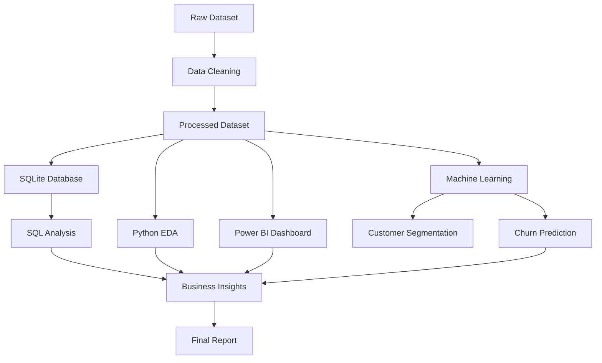

# 📊 Customer Churn Analytics

<div align="center">


### 🚀 End-to-End Customer Churn Analytics using Python, SQL, Power BI & Machine Learning

**Developed as part of the ApexPlanet Data Analytics Internship**

---

</div>

# 📖 Project Overview

Customer churn is one of the most critical business challenges for subscription-based companies. Losing customers directly impacts revenue, profitability, and long-term growth.

This project presents a complete **end-to-end Customer Churn Analytics Pipeline**, starting from raw data preprocessing to advanced analytics, interactive dashboards, customer segmentation, predictive modeling, and automation.

The project follows an industry-standard analytics workflow involving:

- Data Cleaning & Preprocessing
- Exploratory Data Analysis (EDA)
- SQL Business Analysis
- Interactive Dashboards
- Statistical Analysis
- Customer Segmentation
- Predictive Modeling
- Automated Analytics Pipeline

---

# ✨ Features

✅ Data Cleaning & Preprocessing

✅ Exploratory Data Analysis (EDA)

✅ 30+ SQL Business Queries

✅ SQLite Database Integration

✅ Interactive Power BI Dashboard

✅ Plotly Interactive Visualizations

✅ Statistical Analysis

- t-Test
- Chi-Square Test
- ANOVA
- Correlation Analysis

✅ Time Series Analysis

- ADF Test
- ARIMA
- Exponential Smoothing

✅ Customer Segmentation

- K-Means Clustering
- Elbow Method
- PCA Visualization

✅ Customer Churn Prediction

- Logistic Regression
- Decision Tree

✅ Automated Analytics Pipeline

---

# 🏗 Project Architecture



---

# 📂 Project Structure

```
customer-churn-analytics/

│
├── assets/
│
├── dashboards/
│   ├── customer_dashboard.pbix
│   ├── churn_by_contract.html
│   ├── customer_map.html
│
├── data/
│   ├── raw/
│   ├── processed/
│   └── customer_churn.db
│
├── models/
│
├── notebooks/
│   ├── task1_eda.ipynb
│   ├── task2_sql.ipynb
│   ├── task3_visualization.ipynb
│   ├── task4_statistics.ipynb
│   ├── task4_timeseries.ipynb
│   ├── task4_clustering.ipynb
│   └── task4_prediction.ipynb
│
├── reports/
│
├── scripts/
│   ├── automate_pipeline.py
│   ├── create_database.py
│   ├── db_utils.py
│   └── sql_integration.py
│
├── sql/
│   └── queries.sql
│
├── README.md
│
└── requirements.txt
```

---

# 🛠 Tech Stack

| Category | Technologies |
|-----------|--------------|
| Language | Python |
| Database | SQLite |
| Query Language | SQL |
| Dashboard | Power BI |
| Interactive Charts | Plotly |
| Visualization | Matplotlib, Seaborn |
| Data Processing | Pandas, NumPy |
| Machine Learning | Scikit-learn |
| Statistics | SciPy, Statsmodels |
| Notebook | Jupyter |

---

# 📊 Dataset

**Dataset**

IBM Telco Customer Churn Dataset

Dataset contains customer demographic information, subscription details, billing information, customer lifetime value, and churn information.

### Major Features

- Gender
- Senior Citizen
- Partner
- Dependents
- Contract
- Payment Method
- Monthly Charges
- Total Charges
- Tenure
- CLTV
- Internet Service
- Churn Label

---

# 🔄 Analytics Workflow

```
Raw Dataset

↓

Data Cleaning

↓

EDA

↓

SQL Analysis

↓

Interactive Dashboard

↓

Statistical Analysis

↓

Customer Segmentation

↓

Machine Learning

↓

Automation

↓

Business Recommendations
```

---

# 📈 Task-wise Project Summary

## ✅ Task 1

- Environment Setup
- Data Cleaning
- Data Preprocessing
- Exploratory Data Analysis
- Business Insights

---

## ✅ Task 2

- SQLite Database
- Python + SQL Integration
- 30+ SQL Business Queries
- Database Utility Module

---

## ✅ Task 3

- Python Visualizations
- Plotly Interactive Charts
- Power BI Dashboard
- KPI Cards
- Interactive Filters

---

## ✅ Task 4

### Statistical Analysis

- Descriptive Statistics
- Hypothesis Testing
- Correlation Analysis

### Time Series

- ADF Test
- ARIMA
- Exponential Smoothing

### Customer Segmentation

- StandardScaler
- K-Means
- Elbow Method
- PCA

### Predictive Modeling

- Logistic Regression
- Decision Tree
- ROC Curve
- Confusion Matrix
- Feature Importance

---

## ✅ Task 5

- Executive Report
- Automation Pipeline
- Portfolio Documentation
- Final Presentation

---

# 📊 Dashboard Preview

## Executive Dashboard

```
(Add Screenshot Here)

assets/dashboard.png
```

---

## Customer Churn Dashboard

```
(Add Screenshot Here)

assets/powerbi_dashboard.png
```

---

## Customer Segmentation

```
(Add Screenshot Here)

assets/clustering.png
```

---

## Feature Importance

```
(Add Screenshot Here)

assets/feature_importance.png
```

---

# 🚀 Installation

Clone Repository

```bash
git clone https://github.com/yourusername/customer-churn-analytics.git

cd customer-churn-analytics
```

Create Virtual Environment

```bash
python -m venv venv
```

Activate Environment

Windows

```bash
venv\Scripts\activate
```

Linux/Mac

```bash
source venv/bin/activate
```

Install Dependencies

```bash
pip install -r requirements.txt
```

---

# ▶ How to Run

Run Jupyter

```bash
jupyter notebook
```

Run Automation Pipeline

```bash
python scripts/automate_pipeline.py
```

Open Power BI Dashboard

```
dashboards/customer_dashboard.pbix
```

---

# 📈 Project Results

✔ Successfully cleaned and processed customer churn dataset

✔ Built SQLite database

✔ Executed 30+ SQL analytical queries

✔ Developed professional Power BI Dashboard

✔ Created 10+ Python visualizations

✔ Built interactive Plotly dashboards

✔ Performed Statistical Analysis

✔ Applied Time Series Forecasting

✔ Segmented customers using K-Means

✔ Developed Machine Learning models for churn prediction

✔ Automated the analytics workflow

---

# 📌 Business Insights

- Customers with Month-to-Month contracts are more likely to churn.
- Long-term contracts improve customer retention.
- Customers with higher monthly charges exhibit increased churn probability.
- Internet Service type influences churn behavior.
- Customer Lifetime Value varies significantly across customer segments.
- Machine Learning models can assist in identifying high-risk customers for proactive retention strategies.

---

# 🔮 Future Scope

- Deploy Power BI Dashboard to Power BI Service
- Develop a Streamlit Web Application
- Integrate PostgreSQL instead of SQLite
- Real-time Dashboard using APIs
- Cloud Deployment (Azure/AWS/GCP)
- Automated Daily Data Refresh
- Deep Learning-based Churn Prediction
- Customer Recommendation Engine

---

# 📜 License

This project is developed for educational and portfolio purposes as part of the **ApexPlanet Data Analytics Internship**.

---

# 👨‍💻 Author

**Puru Asthana**

B.Tech Computer Science Engineering

Jaypee University of Engineering and Technology

- GitHub: https://github.com/yourusername
- LinkedIn: https://linkedin.com/in/yourprofile

---

<div align="center">

### ⭐ If you found this project useful, consider giving it a Star!
</div>